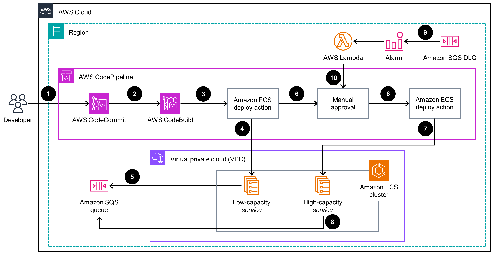
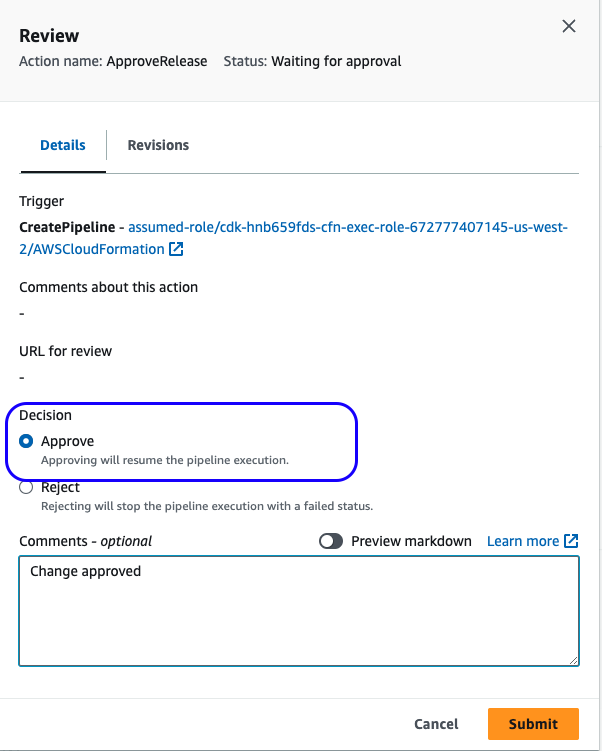

>[!IMPORTANT] 
>This Guidance requires the use of AWS [CodeCommit](https://docs.aws.amazon.com/codecommit/latest/userguide/welcome.html), which is no longer available to new customers. Existing customers of AWS CodeCommit can continue using and deploying this Guidance as normal.

# Guidance for Canary deployments for Queue processing workloads in Amazon ECS

This repository consists AWS Cloud Development Kit (CDK) code for `Canary Deployments for Queue processing workloads in Amazon ECS` guidance.

#### Table of Contents

* [Outcome](#outcome)
* [What are we building?](#what-are-we-building)
* [Reference Architecture](#reference-architecture)
* [Why do we need this?](#why-do-we-need-this)
* [Plan your deployment](#plan-your-deployment)
* [Security](#security)
* [Cleanup](#cleanup)
* [Support and Troubleshooting](#support-and-troubleshooting)
* [License](#license)
* [Notices](#notices)

## Outcome

This solution will enable your teams to build and deploy CI/CD pipeline to implement Canary deployments for queue processing workloads in Amazon ECS.

## What are we building?

* Two Services will be deployed in an [Amazon ECS Cluster](https://aws.amazon.com/ecs/), one is a low-capacity service for handling the [Canary testing](https://www.optimizely.com/optimization-glossary/canary-testing/) traffic and the other is high-capacity service to handle the live traffic
* [AWS CodePipeline](https://aws.amazon.com/codepipeline/) will be used for executing Canary releases using [AWS CodeCommit](https://aws.amazon.com/codecommit/), [AWS CodeBuild](https://aws.amazon.com/codebuild/), ECS Deployment provider via manual approval stage
* The built container images will be stored in the [Amazon Elastic Container Registry](https://aws.amazon.com/ecr/)
* [Amazon Simple Query Service - SQS](https://aws.amazon.com/sqs/) based Consumer sample application is deployed into [AWS ECS Fargate](https://aws.amazon.com/fargate/)
* After sucessful application release testing, both services will run same latest version of the application code

**`⚠️ Warning`** This guidance will utilize [sample-app](https://github.com/aws-solutions-library-samples/guidance-for-ecs-canary-deployments-for-backend-workloads-on-aws/tree/main/sample-app) sample code to demo the Canary release, feel free to replace it with your own application. `⚠️`

## Reference Architecture



### Architecture Components and steps
1. Developer commits new code changes to Software Configuration Management (SCM) tools such as [AWS CodeCommit](https://aws.amazon.com/codecommit/).
2. [AWS CodePipeline](https://aws.amazon.com/codepipeline/) watches for new code changes and initiates a CI/CD pipeline to build a new container image using [AWS CodeBuild](https://aws.amazon.com/codebuild/).
3. After the container image incorporating the change is built, AWS CodePipeline will initiate an [ECS Deploy action](https://docs.aws.amazon.com/codepipeline/latest/userguide/action-reference-ECS.html#action-reference-ECS-type) .
4. ECS Deploy Action will deploy the new container image to low-capacity [ECS Service](https://aws.amazon.com/ecs/) service to start a Canary application version and wait for a manual approval.
5. low-capacity ECS Service will start processing messages from the [Amazon Simple Queue Service - SQS](https://aws.amazon.com/sqs/) using new application version ("Canary") while high-capacity Service will still be serving the existing application version.
6. Once the changes are successfuly validated, team can manually approve the Canary release to propagate the code change to high-capacity ECS Service.
7. ECS Deploy Action will deploy the change to high-capacity ECS Service to complete deployment process.
8. New application version is deployed to both low and high-capacity ECS Services to process messages from SQS Queue.
9. For monitoring potental issues in the new application version, failures in processing SQS messages are sent to [SQS Dead letter Queue (DLQ)](https://docs.aws.amazon.com/AWSSimpleQueueService/latest/SQSDeveloperGuide/sqs-dead-letter-queues.html).
10. [Amazon CloudWatch](https://aws.amazon.com/cloudwatch/) Alarm will monitor the SQS DLQ depth and trigger [AWS Lambda](https://aws.amazon.com/lambda/) function to stop and rollback the Canary release to production/live version in case of failure.

### AWS Services in this Guidance
The following AWS Services are used in this Guidance:
- [Amazon Virtual Private Cloud - VPC](https://aws.amazon.com/vpc/)
- [Amazon Elastic Container Service - ECS](https://aws.amazon.com/ecs/)
- [Amazon Elastic Container Registry - ECR](https://aws.amazon.com/ecr/)
- [Amazon Simple Queue Service - SQS](https://aws.amazon.com/sqs/)
- [AWS Fargate](https://aws.amazon.com/fargate/)
- [AWS CodePipeline](https://aws.amazon.com/codepipeline/)
- [AWS CodeBuild](https://aws.amazon.com/codebuild/)
- [AWS CodeCommit](https://aws.amazon.com/codecommit/)
- [AWS Lambda](https://aws.amazon.com/lambda/)
- [Amazon CloudWatch](https://aws.amazon.com/cloudwatch/)

## Why do we need this?

* With a Canary deployment, you provision a new set of Amazon ECS tasks ("Canary" Service) which deploy the latest version of your application.
* Canary deployments allow you to test the new application version before directing all  traffic to it without disrupting the existing production environment
* Once the testing is completed, you can approve the manual action to release the change to the production ECS service.
* You can incorporate the principle of infrastructure immutability by provisioning fresh instances when you need to make changes. In this way, you avoid configuration drift
* You can also configure CloudWatch Alarm to monitor the Canary release and automatically rollback to production/live version in case of any errors

## Plan your Deployment

### Cost
You are responsible for the cost of the AWS services used while running this Guidance. As of April, 2024, the cost for running this Guidance with the default settings in the US East (N. Virginia) Region is approximately $73.34 monthly, with following assumptions.

### Sample cost table

| Region | Description | Service | Monthly | Assumptions |
| --------------------| ----------------- | -------------------------------| -------------------|----------------|
| US East (N. Virginia) | high-capacity ECS Service           |   AWS Fargate                          | $31.89                | Operating system (Linux), CPU Architecture (x86), Average duration (1 days), Number of tasks or pods (3 per day), Amount of ephemeral storage allocated for Amazon ECS (20 GB) |
| US East (N. Virginia)  |  low-capacity ECS Service           |   AWS Fargate                          | $10.64                | Operating system (Linux), CPU Architecture (x86), Average duration (1 days), Number of tasks or pods (1 per day), Amount of ephemeral storage allocated for Amazon ECS (20 GB) |
| US East (N. Virginia) |  CodeBuild project           |   AWS CodeBuild                          | $3                | Amazon CodeBuild Compute Type (On-Demand EC2), Number of builds in a month (30), Operating system (Linux), Compute instance type (general1.large) |
| US East (N. Virginia) | Canary CodePipeline           |   AWS CodePipeline                           | $0            | Number of active pipelines used per account per month (1) |
| US East (N. Virginia) |  Deployment Lambda             |   AWS Lambda                      | $0                | Invoke Mode (Buffered), Architecture (x86), Architecture (x86), Number of requests (30 per month), Amount of ephemeral storage allocated (512 MB) |
| US East (N. Virginia) |  Canary Deployment Alarm   | Amazon CloudWatch | $0.1 | Number of Standard Resolution Alarm Metrics (1) |
| US East (N. Virginia) |  NAT Gateway  | NAT Gateway | $33.3 | Number of NAT Gateways (1) |
| US East (N. Virginia) | Sample App Queue | Amazon SQS | $0.9 | DT Inbound: Not selected (0 TB per month), DT Outbound: Internet (10 GB per month), Standard queue requests (1 million per month), Data transfer cost (0.9) |
| Total | | | $79.83 | |

### Supported AWS Regions

You should launch this Guidance in an AWS Region where the Amazon ECS, AWS Fargate, Amazon SQS, AWS Lambda, AWS CodePipeline, AWS CodeBuild, and AWS CodeCommit services are available. For the most current availability of AWS services by Region, please refer to the [AWS Regional Services List](https://aws.amazon.com/about-aws/global-infrastructure/regional-product-services/).

### What are the pre-requisites?

```shell
brew install jq
npm install -g -f aws-cdk@2.124.0
git clone https://github.com/aws-solutions-library-samples/guidance-for-ecs-canary-deployments-for-backend-workloads-on-aws.git
cd guidance-for-ecs-canary-deployments-for-backend-workloads-on-aws/
export REPO_BASE_DIR=$PWD
```
* You have configured AWS CLI using `aws configure`
* You have the set the `AWS_REGION` within `aws configure` or explicitly pass the AWS_REGION to the deployment scripts
* The role being used from CLI has the permissions required for resources being created by CDK
* HTTPS (GRC) is the protocol to use with `git-remote-codecommit` (GRC). This utility provides a simple method for pushing and pulling code from CodeCommit repositories by extending Git. It is the recommended method for supporting connections made with federated access, identity providers, and temporary credentials
* Install `git-remote-codecommit` with `pip install git-remote-codecommit`

### How can we deploy the stack?

* Install dependencies, build the project, and run the test-suite. Run the following commands:
    ```shell
    cd $REPO_BASE_DIR/cdk
    npm install
    npm run build
    npm run test
    ```
    If the tests are successful, you would see following output:
    ```output
    > ecs-canary-pattern@1.0.0 test
    > jest

    PASS  test/cdk.test.ts
    ✓ Canary deployment pipeline is created (639 ms)

    Test Suites: 1 passed, 1 total
    Tests:       1 passed, 1 total
    Snapshots:   0 total
    Time:        2.418 s, estimated 3 s
    Ran all test suites.
    ```

* Deploy the AWS CodeCommit and AWS CodeBuild resources using the following command, you can pass the CDK Image Stack name and AWS region as input arguments respectively.

    ```shell
    cd $REPO_BASE_DIR/cdk
    ./bin/scripts/deploy-image-stack.sh CanaryContainerImageStack us-west-2
    ```
    Output
    ```output
    Start building the container image stack resources....
    ⏳  Bootstrapping environment aws://123456789012/us-west-2...
    ......
     ✅  CanaryContainerImageStack

    ✨  Deployment time: 56.97s

    Outputs:
    CanaryContainerImageStack.EcsCanaryBuildImagecanaryCodeBuildProjectName1815536D = EcsCanaryBuildImagecodeBuil-BNyAmPT25TLJ
    CanaryContainerImageStack.EcsCanaryBuildImageecsCanaryCodeRepoCloneURLD27FA1F6 = https://git-codecommit.us-west-2.amazonaws.com/v1/repos/sample-app
    CanaryContainerImageStack.EcsCanaryBuildImageecsCanaryCodeRepoNameF3261253 = sample-app
    CanaryContainerImageStack.EcsCanaryBuildImageecsCanaryEcrRepoName9A7C4155 = canarycontainerimagestack-ecscanarybuildimageecrrepod573c8bd-5kpcqnxuzbtq
    CanaryContainerImageStack.EcsCanaryRolescanaryCodeBuildProjectRoleArn783B7D46 = arn:aws:iam::123456789012:role/CanaryContainerImageStack-EcsCanaryRolescodeBuildSe-s8nJosAAZPqN
    CanaryContainerImageStack.EcsCanaryRolescustomLambdaRoleArn582FD71A = arn:aws:iam::123456789012:role/CanaryContainerImageStack-EcsCanaryRolescodePipelin-WPz1nR6HkR8i
    CanaryContainerImageStack.EcsCanaryRolesecsCanaryTaskExecRoleArn98EF953D = arn:aws:iam::123456789012:role/CanaryContainerImageStack-EcsCanaryRolesecsExecutio-Pp5zJRqKcq3w
    CanaryContainerImageStack.EcsCanaryRolesecsCanaryTaskRoleArnDC60EF84 = arn:aws:iam::123456789012:role/CanaryContainerImageStack-EcsCanaryRolesecsTaskRole-gXGZpgBoggKI
    Stack ARN:
    arn:aws:cloudformation:us-west-2:123456789012:stack/CanaryContainerImageStack/0e697470-e55f-11ee-a973-0a37f5cb806d

    ✨  Total time: 59.26s

    Completed building the container image stack resources....
    ```

* Push the sample application source code to AWS CodeCommit repository:
  * The source code is available [here](sample-app)
  * The [buildspec.yml](sample-app/buildspec.yml) has instructions to build and push the container image to the ECR Repository. 
    ```shell
    export AWS_DEFAULT_REGION=$(aws configure get region) #Replace with your AWS Region here
    export CODE_REPO_NAME=sample-app
    export CODE_REPO_URL=codecommit::$AWS_DEFAULT_REGION://$CODE_REPO_NAME
    cd $REPO_BASE_DIR/.. && git clone $CODE_REPO_URL && cd $CODE_REPO_NAME
    cp $REPO_BASE_DIR/sample-app/* .
    git checkout -b main
    git remote -v
    git add .
    git commit -m "Initial commit"
    git push --set-upstream origin main
    ```

    Output
    ```output
    .....
    To codecommit::us-west-2://sample-app
    * [new branch]      main -> main
    branch 'main' set up to track 'origin/main'.
    ```

* Deploy the AWS CodePipeline, Amazon ECS resources. Run the following commands and pass Image Stack name and AWS region as input arguments:
    ```shell
    cd $REPO_BASE_DIR/cdk
    ./bin/scripts/deploy-pipeline-stack.sh CanaryContainerImageStack us-west-2
    ```
    
    Output
    ```output
    Exporting the cloudformation stack outputs....
    ....
    CanaryPipelineStack:  start: Building d07841374438c41280a0e8110c8f382763134647ee8872af1e5c36816d8161be:current_account-current_region
    CanaryPipelineStack:  success: Built d07841374438c41280a0e8110c8f382763134647ee8872af1e5c36816d8161be:current_account-current_region
    CanaryPipelineStack:  start: Publishing d07841374438c41280a0e8110c8f382763134647ee8872af1e5c36816d8161be:current_account-current_region
    CanaryPipelineStack:  success: Published d07841374438c41280a0e8110c8f382763134647ee8872af1e5c36816d8161be:current_account-current_region
    CanaryPipelineStack: deploying... [1/1]
    CanaryPipelineStack: creating CloudFormation changeset...

    ✅  CanaryPipelineStack

    ✨  Deployment time: 267.93s

    Outputs:
    CanaryPipelineStack.EcsCanarySQSecsCanaryDLQNameA201FB0B = sample-app-dlq
    CanaryPipelineStack.EcsCanarySQSecsCanaryQueueNameD0C84D5F = sample-app
    Stack ARN:
    arn:aws:cloudformation:us-west-2:123456789012:stack/CanaryPipelineStack/9e3998e0-e560-11ee-991c-0a815a04b4b3

    ✨  Total time: 270.72s

    Completed building the CodePipeline resources....

    ```

At this point, both Amazon ECS Services (low-capacity - `sample-app-canary` & high-capacity - `sample-app`) along with AWS CodePipeline are deployed to your AWS Account. 
Please note that low-capacity ("Canary") ECS Service will always have tasks running. During an active deployment it will have ECS tasks running the new code version and, once testing completed, it will match code versions with high-capacity service.

### Start a deployment

Make a source code change in your local folder and commit changes to AWS CodeCommit repo. It will kick off the deployment and wait for Manual approval step.



Simulate the load by running the command script below, it will post 100 messages to the Amazon SQS Queue.

```shell
cd $REPO_BASE_DIR/cdk
./bin/scripts/send-sqs-message.sh us-west-2
```

Output
```output
Sending messages...
Queue URL:  https://sqs.us-west-2.amazonaws.com/123456789012/sample-app
....
```

You would notice messages are being processed by ECS Tasks running in both low-capacity & high-capacity services.
```output
validate that `sample-app-canary` Canary service processes messages containing "Body: "Test Msg: 2-5"....
afterwards validate that `sample-app` main service processes messages as well with "Body: "Test Msg: 2-5", 
```
As low-capacity ("Canary") ECS service is running new version of the code, you can safely test the changes before manually approving the change in AWS CodePipeline.

## Security

When you build systems on AWS infrastructure, security responsibilities are shared between you and AWS. This [Shared Responsibility Model](https://aws.amazon.com/compliance/shared-responsibility-model/) reduces your operational burden because AWS operates, manages, and controls the components, including the host operating system, the virtualization layer, and the physical security of the facilities in which the services operate. For more information about AWS security, visit [AWS Cloud Security](http://aws.amazon.com/security/).

The following Services are used to enhance the security of this Guidance: Amazon ECS, AWS Fargate, [Amazon Virtual Private Cloud](https://aws.amazon.com/vpc/) (Amazon VPC), [AWS Identity and Access Management](https://aws.amazon.com/iam/) (IAM) roles and policies, and Amazon ECR.

The ECS cluster resources are deployed within Virtual Private Clouds (VPCs).
Amazon VPC provides a logical isolation of its resources from the public internet. Amazon VPC supports a variety of security features, such as security groups, network access control lists (ACLs), which are used to control inbound and outbound traffic to resources, and IAM roles or policies for authorizating limited access to protected resources.
The Amazon ECR image registry provides additional container level security features such as CVE vulnerability scanning etc., and follow the Open Container Initiative security standards.

See [CONTRIBUTING](CONTRIBUTING.md#security-issue-notifications) for more information.

## Cleanup

To avoid ongoing charges, you can delete the guidance infrastructure running the command below, and pass the Image Stack name and AWS Region as input arguments.

```shell
cd $REPO_BASE_DIR/cdk CanaryContainerImageStack us-west-2
./bin/scripts/destroy.sh
```

Output:
```output
Start cleanup...
Are you sure you want to delete: CanaryPipelineStack (y/n)? y
CanaryPipelineStack: destroying... [1/1]

....

 ✅  CanaryPipelineStack: destroyed

Are you sure you want to delete: CanaryContainerImageStack (y/n)? y
CanaryContainerImageStack: destroying... [1/1]

....

 ✅  CanaryContainerImageStack: destroyed

Cleanup completed...
```

## Support and Troubleshooting
### Support & Feedback
`Guidance for Canary deployments for Queue processing workloads in Amazon ECS` is an Open-Source project maintained by AWS Solution Architects. It is not an AWS service and support is provided on a best-effort basis by AWS Solution Architects and the user community. To post feedback, submit feature ideas, or report bugs, you can use the Issues section of the project GitHub repo.

If you are interested in contributing to the Sample code, you can follow the [Contribution guide](CONTRIBUTING.md).

### Version Requirements
This version of guidance the following version of core tools/services:

| Name       | Version  |
| ---------- | -------- |
| aws        | >= 2.11.2 |
| cdk       | >= 2.124.0 |
| go | >= 1.21 |
| python | >= 3.10 |

### Customization
Please keep in mind that all scripts and configuration files provided in this Guidance are very customizable, mostly through modifying the related shell script files in various deployment steps. For example, [Deploy the image stack](cdk/bin/scripts/deploy-image-stack.sh) or [Deploy the pipeline stack](cdk/bin/scripts/deploy-pipeline-stack.sh).

This Guidance has been successfully tested with values of those parameters used in the sample code in the [repository project](https://github.com/aws-solutions-library-samples/guidance-for-ecs-canary-deployments-for-backend-workloads-on-aws). This Guidance includes a `sample-app` application which is a SQS processor, replace this with your own application or modify the AWS CodePipeline source stage to point to your SCM repository.

This Guidance deploys 3 ECS tasks in high-capacity ECS service and 1 ECS task in low-capacity ECS service for canary testing. You can update those values in [`build-pipeline.ts`](cdk/lib/pipeline/build-pipeline.ts)

### Troubleshooting

#### When deploying the AWS CDK stacks, I receive a NoSuchBucket error
Your AWS environment has not been bootstrapped, and so does not have an Amazon S3 bucket to hold resources during deployment. This is done as part of `cdk/bin/scripts/deploy-image-stack.sh`. You can create the staging bucket and other required resources with the following command:

```bash
cdk bootstrap aws://ACCOUNT-NUMBER/REGION
```

#### When deploying the AWS CDK stacks, I receive a forbidden: null message
You are deploying a stack that requires bootstrap resources, but are using an IAM role or account that lacks permission to write to it. (The staging bucket is used when deploying stacks that contain assets or that synthesize an AWS CloudFormation template larger than 50K.) Use an account or role that has permission to perform the action s3:* against the bucket mentioned in the error message.

#### When deploying the AWS CDK stacks, I receive Unable to resolve AWS account to use.
Your AWS credentials are not correctly configured in your shell terminal. Refer [Configure the AWS CLI](https://docs.aws.amazon.com/cli/latest/userguide/cli-chap-configure.html#configure-precedence) for additional details.

#### When deploying the Pipeline stack, CodeBuild build is FAILED
Look at the AWS CodeBuild build logs to investigate why the CodeBuild project build is failed to succeed. One of the possible reason could be empty source repo, or in-correct source configuration in the AWS CodeBuild project.

## License

This library is licensed under the MIT-0 License. See the [LICENSE](LICENSE) file.

## Notices
Customers are responsible for making their own independent assessment of the information in this document. This document: (a) is for informational purposes only, (b) represents AWS current product offerings and practices, which are subject to change without notice, and (c) does not create any commitments or assurances from AWS and its affiliates, suppliers or licensors. AWS products or services are provided “as is” without warranties, representations, or conditions of any kind, whether express or implied. AWS responsibilities and liabilities to its customers are controlled by AWS agreements, and this document is not part of, nor does it modify, any agreement between AWS and its customers.
