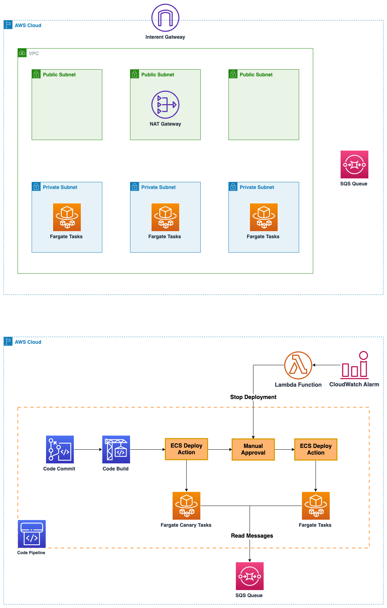

# Guidance for implementing Canary deployments for backend Amazon ECS workloads on AWS

This repository consists AWS Cloud Development Kit (CDK) code for `Canary Deployment for backend ECS workloads` solution guidance.

#### Table of Contents

* [Outcome](#outcome)
* [What are we building?](#what-are-we-building)
* [Why do we need this?](#why-do-i-need-this)
* [What are the pre-requisites?](#what-are-the-pre-requisites)
* [How can we deploy the stack?](#how-can-i-deploy-the-stack)
* [Cleanup](#cleanup)
* [Security](#security)
* [License](#license)

## Outcome

This solution will enable your teams to build and deploy CI/CD pipeline to implement Canary releases for  backend/queue processing ECS workloads.

## What are we building?

* Two Amazon ECS Services will be deployed in an ECS Cluster, one is a low capacity service for handling the Canary traffic and the other is high capacity service to handle the live traffic
* AWS CodePipeline will be used for executing Canary releases using AWS CodeCommit, AWS CodeBuild, ECS Deployment provider and a manual approval stage
* The container images will be stored in the Amazon Elastic Container Registry
* SQS Consumer sample application is deployed in AWS Fargate
* After sucessful release, both services will run same version of the code

**`⚠️ Warning`** This guidance will utilize [sample-app](sample-app) to demo the Canary release, feel free to replace it with your own application. `⚠️`

## High Level Architecture



## Why do we need this?

* With a Canary deployment, you provision a new set of ECS tasks (Canary Service) on which the latest version of your application is deployed
* Canary deployments allow you to test the new application version before sending production traffic to it without disrupting the existing environment
* Once the testing is completed, you can approve the manual action to release the change to the production ECS tasks
* You can incorporate the principle of infrastructure immutability by provisioning fresh instances when you need to make changes. In this way, you avoid configuration drift
* You can also configure CloudWatch Alarm to monitor the Canary release and automatically rollback to production/live version in case of any errors

## What are the pre-requisites?

```shell
brew install jq
npm install -g -f aws-cdk@2.87.0
git clone https://github.com/aws-solutions-library-samples/guidance-for-ecs-canary-deployments-for-backend-workloads-on-aws.git
cd guidance-for-ecs-canary-deployments-for-backend-workloads-on-aws/cdk
```
* You have configured AWS CLI using `aws configure`
* You have the set the `AWS_REGION` within `aws configure`
* The role being used from CLI has the permissions required for resources being created by CDK
* HTTPS (GRC) is the protocol to use with `git-remote-codecommit` (GRC). This utility provides a simple method for pushing and pulling code from CodeCommit repositories by extending Git. It is the recommended method for supporting connections made with federated access, identity providers, and temporary credentials
* Install `git-remote-codecommit` with `pip install git-remote-codecommit`

## How can we deploy the stack?

* Install dependencies and build
    ```shell
    npm install
    npm run build
    npm run test
    ```
* Deploy the CodeCommit and CodeBuild resources
    ```shell
    ./bin/scripts/deploy-image-stack.sh
    ```
* Push the source code to CodeCommit
  * The source code is available [here](sample-app/README.md)
  * The [buildspec.yml](sample-app/buildspec.yml) has placeholders for the variables
    ```shell
    export AWS_DEFAULT_REGION=$(aws configure get region)
    export CODE_REPO_NAME=sample-app
    export CODE_REPO_URL=codecommit::$AWS_DEFAULT_REGION://$CODE_REPO_NAME
    cd ../.. && git clone $CODE_REPO_URL && cd $CODE_REPO_NAME
    cp ../guidance-for-ecs-canary-deployments-for-backend-workloads-on-aws/sample-app/* .
    git checkout -b main
    git remote -v
    git add .
    git commit -m "Initial commit"
    git push --set-upstream origin main
    ```
* Deploy the CodePipeline resources
    ```shell
    cd ../guidance-for-ecs-canary-deployments-for-backend-workloads-on-aws/cdk/
    ./bin/scripts/deploy-pipeline-stack.sh
    ```

## Cleanup

```shell
./bin/scripts/destroy.sh
```

## Security

See [CONTRIBUTING](CONTRIBUTING.md#security-issue-notifications) for more information.

## License

This library is licensed under the MIT-0 License. See the LICENSE file.
